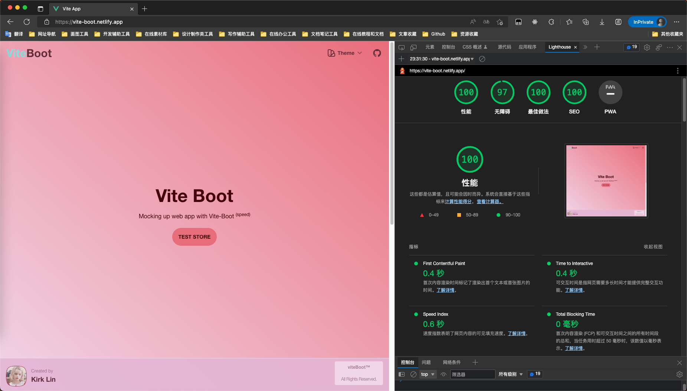

<div align='center'>
<h1>Vite-Boot </h1>

</div>

<p align='center'>
Mocking up web app with <b>Vite-Boot </b><sup><em>(speed)</em></sup><br>
</p>

<div align='center'>
<b>English</b> | <a href="README.zh-CN.md">简体中文</a>
</div>

## Features

- ⚡  [Lightning fast](https://github.com/kirklin/vite-boot#readme): Built with Vue 3, Vite, and pnpm 🔥
- 💪 [Strongly typed](https://www.typescriptlang.org/): Uses TypeScript 💻
- 🔥 [Latest syntax](https://github.com/vuejs/rfcs/pull/227): Uses the new <script setup> syntax 🆕
- 📦 [Components auto importing](./src/components): Automatically imports components 🚚
- 📥 [APIs auto importing](https://github.com/antfu/unplugin-auto-import): Uses unplugin-auto-import to directly import Composition API and others 📨
- 🎨 [UnoCSS](https://unocss.dev/) - The instant on-demand atomic CSS engine, providing a lightweight and fast way to style your app.
- 🌼 [Daisy](https://daisyui.com/) - The free and open-source Tailwind CSS component library
- 💡 [Official router](https://router.vuejs.org/): Uses Vue Router v4 🛣️
- 🎉 [Loading feedback](https://github.com/rstacruz/nprogress): Uses NProgress to provide page loading progress feedback 🔄
- 🍍 [State management](https://pinia.esm.dev/): Uses Pinia for state management 🗃️
- 📜 [Chinese font preset](https://github.com/kirklin/unocss-preset-chinese): Includes a preset for Chinese fonts 🇨🇳
- 🌍 [I18n ready](./src/locales): Ready for internationalization with locales 🌎
- ☁️ [Netlify ready](https://www.netlify.com/): Zero-config deployment on Netlify ☁️

### Coding Style

- [@kirklin/eslint-config](https://github.com/kirklin/eslint-config)

### Recommended IDE Setup

- 🌪️ [WebStorm](https://www.jetbrains.com/webstorm/)
- 💻 [VSCode](https://code.visualstudio.com/)
- 💡 [Volar](https://marketplace.visualstudio.com/items?itemName=johnsoncodehk.volar)

### Performance



## directory

```
# vite-boot
├── LICENSE
├── README.assets
│   └── vite-vue-tailwind.png
├── README.md
├── README.zh-CN.md
├── index.html
├── node_modules
├── package.json
├── pnpm-lock.yaml
├── public
│   └── favicon.ico
├── src
│   ├── App.vue
│   ├── api                  # api interface
│   ├── assets               # static resource
│   │   └── logo.png
│   ├── components           # global component
│   ├── main.ts
│   ├── router               # Vue router
│   │   └── index.ts
│   ├── settings.ts          # global configuration
│   ├── store                # Pinia store
│   │   ├── counter.ts
│   │   └── index.ts
│   ├── styles               # global style
│   │   ├── main.css
│   │   ├── nprogress.css   # nprogress style
│   │   └── variables.css
│   ├── utils                # global public method
│   │   └── darkMode.ts
│   └── views                # all pages
│       └── Index.vue
├── tsconfig.json            # TS compilation configuration
├── Dockerfile               # Docker configuration
└── vite.config.ts           # Vite configuration

```

## Try it now!

### GitHub Template

[Create a repo from this template on GitHub](https://github.com/kirklin/vite-boot/generate).

### Clone to local

```bash
npx degit kirklin/vite-boot my-vite-app
cd my-vite-app
pnpm i
```

## Usage

### Development

Just run and visit http://localhost:8888

```bash
pnpm run dev
```

### Build

To build the App, run

```bash
pnpm run build
```

And you will see the generated file in `dist` that ready to be served.


### Deploy on Netlify

Go to [Netlify](https://app.netlify.com/start) and select your clone, `OK` along the way, and your App will be live in a minute.

### Docker Production Build

First, build the vite-boot image by opening the terminal in the project's root directory.

```bash
docker buildx build . -t viteboot:latest
```

Run the image and specify port mapping with the `-p` flag.

```bash
docker run --rm -it -p 8080:80 viteboot:latest
```

