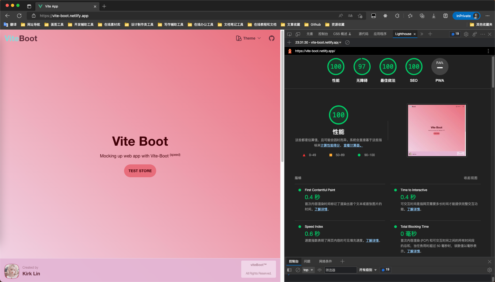

<div align='center'>
<h1>Vite-Boot </h1>

</div>

<p align='center'>
Mocking up web app with <b>Vite-Boot </b><sup><em>(speed)</em></sup><br>
</p>

<div align='center'>
<b>English</b> | <a href="README.zh-CN.md">简体中文</a>
</div>

## Features

- ⚡  [Vue 3](https://github.com/vuejs/vue-next), [Vite 2](https://github.com/vitejs/vite), [pnpm](https://pnpm.js.org/) - born with fastness
- 💪 [Typescript](https://www.typescriptlang.org/) - of course! necessary
- 🔥 Use the [new `<script setup>` syntax](https://github.com/vuejs/rfcs/pull/227)
- 🤙🏻 [Reactivity Transform](https://vuejs.org/guide/extras/reactivity-transform.html) enabled
- 📦 [Components auto importing](./src/components)
- 📥 [APIs auto importing](https://github.com/antfu/unplugin-auto-import) - use Composition API and others directly
- 💡 [Vue Router v4](https://router.vuejs.org/zh/) - The official router for Vue.js
- 🎨 [Tailwind CSS v3](https://tailwindcss.com/docs/configuration) - Rapidly build modern websites without ever leaving your HTML.
- 🎉 [NProgress](https://github.com/rstacruz/nprogress) - Page loading progress feedback
- 🍍 [State Management via Pinia](https://pinia.esm.dev/) - The Vue Store that you will enjoy using
- 🌼 [Daisy](https://daisyui.com/) - The free and open-source Tailwind CSS component library
- 📜 [Chinese font preset]()
- ☁️ Deploy on Netlify, zero-config

### First-party plugins needed for Tailwind UI:

- [tailwindcss/forms](https://github.com/tailwindlabs/tailwindcss-forms)
- [tailwindcss/typography](https://tailwindcss.com/docs/typography-plugin)
- [tailwindcss/line-clamp](https://github.com/tailwindlabs/tailwindcss-line-clamp)
- [tailwindcss/aspect-ratio](https://github.com/tailwindlabs/tailwindcss-aspect-ratio)

### Coding Style

- [@kirklin/eslint-config](https://github.com/kirklin/eslint-config)

### Recommended IDE Setup

- [VSCode](https://code.visualstudio.com/)
- [Volar](https://marketplace.visualstudio.com/items?itemName=johnsoncodehk.volar)

### Performance



## directory

```
# vite-boot
├── LICENSE
├── README.assets
│   └── vite-vue-tailwind.png
├── README.md
├── README.zh-CN.md
├── index.html
├── node_modules
├── package.json
├── pnpm-lock.yaml
├── postcss.config.js        # tailwind configuration
├── public
│   └── favicon.ico
├── src
│   ├── App.vue
│   ├── api                  # api interface
│   ├── assets               # static resource
│   │   └── logo.png
│   ├── components           # global component
│   │   └── Navbar.vue       # Navbar component
│   ├── env.d.ts
│   ├── main.ts
│   ├── router               # Vue router
│   │   └── index.ts
│   ├── settings.ts          # global configuration
│   ├── store                # Pinia store
│   │   ├── counter.ts
│   │   └── index.ts
│   ├── styles               # global style
│   │   ├── main.scss
│   │   ├── nprogress.scss   # nprogress style
│   │   ├── tailwind.css
│   │   └── variables.scss
│   ├── utils                # global public method
│   │   └── darkMode.ts
│   └── views                # all pages
│       └── Index.vue
├── tailwind.config.js       # tailwind configuration
├── tsconfig.json            # TS compilation configuration
└── vite.config.ts           # Vite configuration

```

## Try it now!

### GitHub Template

[Create a repo from this template on GitHub](https://github.com/kirklin/vite-boot/generate).

### Clone to local

```bash
npx degit kirklin/vite-boot my-vite-app
cd my-vite-app
pnpm i
```

## Usage

### Development

Just run and visit http://localhost:8888

```bash
pnpm run dev
```

### Build

To build the App, run

```bash
pnpm run build
```

And you will see the generated file in `dist` that ready to be served.


### Deploy on Netlify

Go to [Netlify](https://app.netlify.com/start) and select your clone, `OK` along the way, and your App will be live in a minute.

### Docker Production Build

First, build the vitesse image by opening the terminal in the project's root directory.

```bash
docker buildx build . -t vitesse:latest
```

Run the image and specify port mapping with the `-p` flag.

```bash
docker run --rm -it -p 8080:80 vitesse:latest
```

